# 🍽️ Restaurante Ñan Ñan - Sistema de Gestión y Reservas

## 📖 Descripción

Restaurante Ñan Ñan es una aplicación web desarrollada como proyecto completo de desarrollo Full Stack para la gestión integral de un restaurante.

La aplicación permite a los clientes consultar el menú diario, realizar reservas online, publicar reseñas y gestionar sus propias reservas.

Además, incorpora un sistema de administración para la gestión de clientes, empleados, platos, menús diarios y reservas.

---

## 🎯 Objetivos del proyecto

Este proyecto nace con el objetivo de simular una aplicación real utilizada por un restaurante para centralizar toda su operativa diaria.

Entre los objetivos principales destacan:

* Gestión de reservas online.
* Administración de clientes.
* Gestión de empleados.
* Publicación de menús diarios.
* Gestión de carta de platos.
* Sistema de reseñas verificadas.
* Paneles diferenciados según el rol del usuario.
* Diseño responsive para usuarios finales.

---

## 🚀 Funcionalidades principales

### Cliente

* Registro de cuenta.
* Inicio de sesión seguro.
* Reserva de mesas online.
* Cancelación de reservas.
* Consulta de reservas activas.
* Publicación de reseñas.
* Consulta de carta.
* Consulta de menú diario.

### Administrador

* Gestión completa de clientes.
* Gestión completa de empleados.
* Gestión completa de platos.
* Gestión completa de menús diarios.
* Gestión de reservas.
* Moderación de reseñas.
* Configuración de contenidos de la página principal.

### Sistema

* Control de sesiones.
* Gestión de roles.
* Validación cliente y servidor.
* APIs REST internas.
* Arquitectura modular.
* Sistema de mensajes y avisos personalizados.

---

### Organización

## 🏗️ Arquitectura del proyecto

```text
BarApp/
│
├── api/
│   ├── login_api.php
│   ├── reservas_api.php
│   ├── menu_diario_api.php
│   ├── clientes_api.php
│   ├── empleados_api.php
│   ├── resenas_api.php
│   └── ...
│
├── assets/
│   ├── css/
│   ├── js/
│   └── img/
│
├── components/
│   ├── header.php
│   └── footer.php
│
├── database/
│   ├── db.php
│   └── gastroreservas.sql
│
├── docs/
│   ├── capturas/
│   └── diagramas/
│
└── pages/
    ├── index.php
    ├── login.php
    ├── registro.php
    ├── panel_cliente.php
    ├── panel_admin.php
    └── ...
```

### 📂 Organización de carpetas

#### api/

Contiene todos los endpoints de la aplicación.

La lógica de negocio se encuentra separada de la interfaz de usuario mediante APIs PHP que reciben peticiones AJAX desde JavaScript.

Ejemplos:

- Gestión de reservas.
- Gestión de clientes.
- Gestión de empleados.
- Gestión de menús diarios.
- Gestión de reseñas.
- Autenticación.

---

#### assets/

Recursos estáticos de la aplicación.

##### css/

Hojas de estilo globales y responsive.

##### js/

Lógica cliente desarrollada en JavaScript ES6.

Incluye:

- Gestión de reservas.
- Login y registro.
- Carrusel dinámico.
- Menú diario.
- Paneles de administración.

##### img/

Imágenes utilizadas por la aplicación.

- Platos.
- Carrusel.
- Elementos gráficos.
- Recursos de interfaz.

---

#### components/

Componentes reutilizables compartidos por toda la aplicación.

Actualmente incluye:

- Header.
- Footer.

Esta estructura evita duplicar código entre páginas.

---

#### database/

Configuración de acceso a base de datos y scripts relacionados con MariaDB/MySQL.

Incluye:

- Conexión PDO.
- Configuración centralizada.
- Scripts de creación de tablas.

---

#### docs/

Documentación técnica del proyecto.

Aquí se almacenan:

- Capturas de pantalla.
- Diagramas de base de datos.
- Recursos para el README.
- Documentación complementaria.

---

#### pages/

Interfaces visibles por los usuarios.

Incluye tanto las páginas públicas como los paneles privados.

Ejemplos:

- Página principal.
- Login.
- Registro.
- Zona cliente.
- Panel de administración.
- Gestión de reservas.
- Gestión de empleados.
- Gestión de clientes.

### Componentes principales

* API REST interna desarrollada en PHP.
* Frontend HTML + CSS + JavaScript.
* Base de datos MySQL/MariaDB.
* Componentes reutilizables (header/footer).
* Sistema de sesiones PHP.

---

## 🗄️ Base de datos

### Entidades principales

* Clientes
* Empleados
* Reservas
* Mesas
* Menú diario
* Platos
* Reseñas

## 🗄️ Modelo de datos

```text
CLIENTES
   │
   ├── 1:N ── RESERVAS
   │
   └── 1:N ── RESEÑAS

RESERVAS
   │
   └── N:M ── MESAS

MENU_DIARIO
   │
   └── 1:N ── MENU_DIARIO_ITEMS
                 │
                 └── N:1 ── CARTA_PLATOS

TRABAJADORES
   │
   ├── Gestionan reservas
   ├── Gestionan clientes
   ├── Gestionan menús diarios
   ├── Gestionan carta de platos
   ├── Moderan reseñas
   └── Configuran el contenido dinámico de la página principal
```

### 📋 Descripción

La base de datos está organizada en torno a tres áreas principales:

- Gestión de clientes y reservas.
- Gestión de menús y carta del restaurante.
- Gestión administrativa realizada por trabajadores autorizados.

Las relaciones permiten gestionar reservas, asignación de mesas, publicación de reseñas y configuración dinámica de contenidos mostrados en la página principal.

---

## 🎨 Interfaz de usuario
* El usuario puede ver las siguiente secciones.

### Contenido de la página principal

* Reservas y registro.
* Hero dinámico - carrusel de platos.
* Menú del día actualizado.
* Carta del restaurante.
* Reseñas destacadas y ver todas las reseñas.

---

### 🖼️ Hero dinámico

La página principal incorpora un hero dinámico que rota automáticamente cada pocos segundos, mostrando algunos de los platos más destacados del restaurante.

Este elemento busca mejorar la experiencia visual del usuario y ofrecer una presentación atractiva de la oferta gastronómica desde el primer momento.

#### Hero de la web

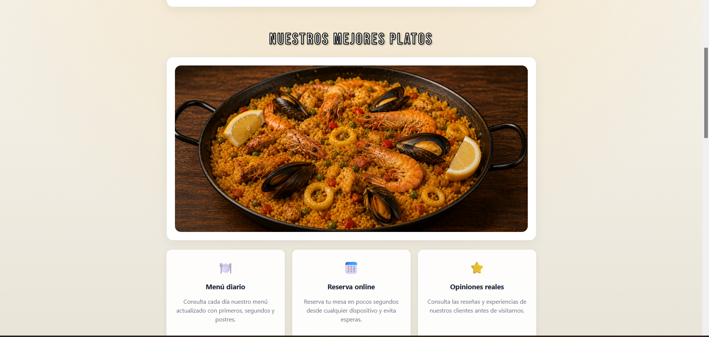

---


## 🔐 Sistema de autenticación

La aplicación implementa un sistema de autenticación basado en sesiones PHP para garantizar el acceso seguro a las zonas privadas.

### Características

* Contraseñas almacenadas de forma segura mediante `password_hash()`.
* Verificación de credenciales mediante `password_verify()`.
* Gestión de sesiones mediante `$_SESSION`.
* Control de acceso basado en roles (cliente y trabajador).
* Protección de páginas privadas frente a accesos no autorizados.
* Cierre seguro de sesión mediante destrucción de la sesión activa.
* Validación de formularios tanto en cliente (JavaScript) como en servidor (PHP).
* Redirección automática según el perfil autenticado:

  * Cliente → Zona Cliente.
  * Trabajador → Panel de Administración.

### Seguridad aplicada

* Validación y saneamiento de datos de entrada.
* Verificación de sesiones en páginas protegidas.
* Restricción de funcionalidades según el rol del usuario.
* Protección frente a contraseñas almacenadas en texto plano.

#### Login para clientes / trabajadores

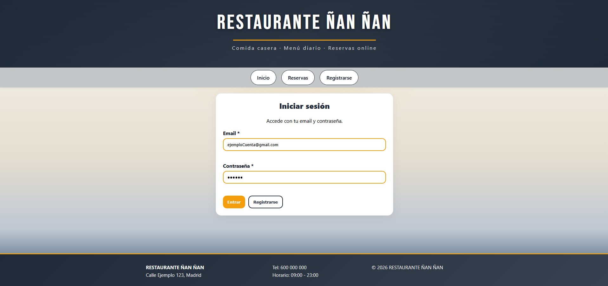

---

## 📅 Zona de clientes (reservas y reseñas)

El módulo de zona clientes permite reservar mesa y poner reseñas:

* Selección de fecha.
* Selección de turno (comida o cena).
* Gestión automática de disponibilidad.
* Asignación de mesas.
* Cancelación de reservas.
* Poner una reseña y editar la reseña.

#### Crear reservas - cliente

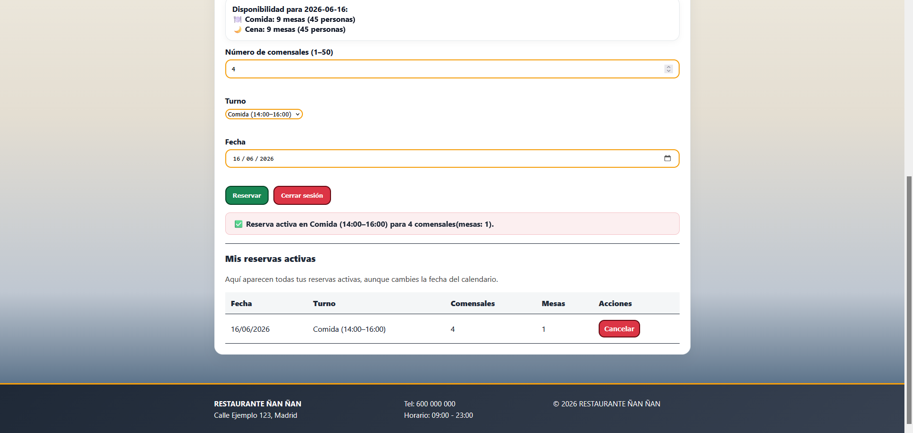

#### Crear reseña - cliente 

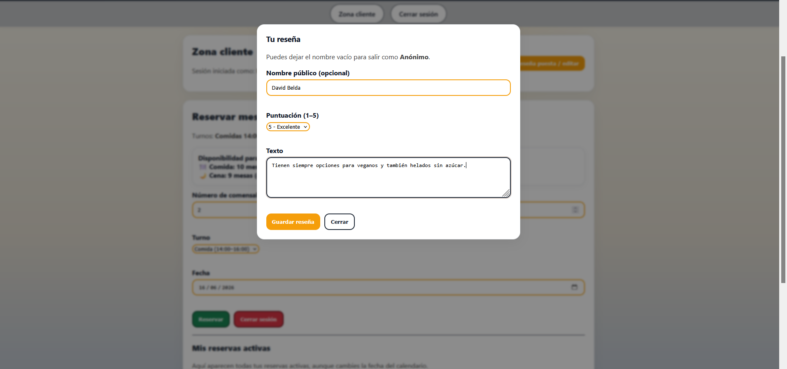


---

## 🍴 Menú diario y carta del restaurante.

El cliente puede ver:

* Menú diario y fecha del día.
* Carta del restaurante.

El menú diario y la carta son editados desde la zona del gestor, el cuál podrá crear platos, añadirlos a la carta y con ellos crear los menús diarios.

#### Ver menú del día
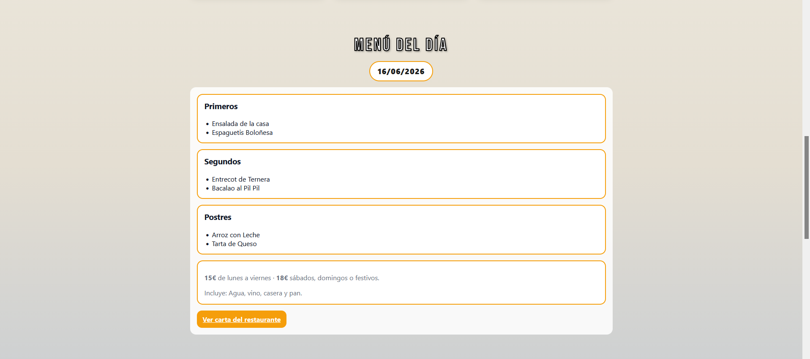

#### Ver carta del restaurante
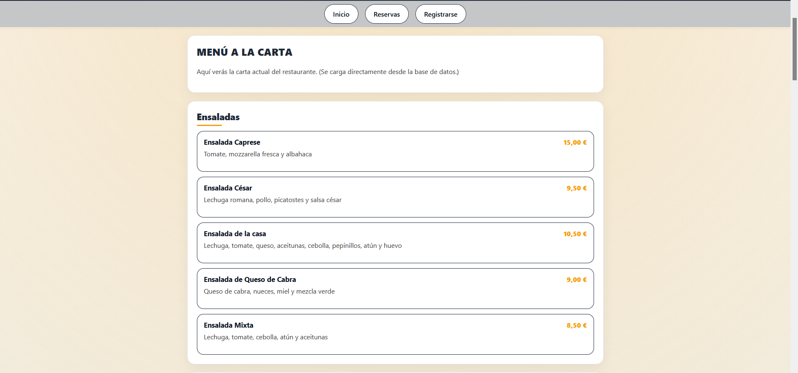

---

## ⭐ Sistema de reseñas

Los usuarios registrados pueden publicar reseñas sobre su experiencia.

Características:

* Puntuación de 1 a 5 estrellas.
* Comentarios personalizados.
* Visualización pública.
* Gestión administrativa.

#### Ver últimas reseñas en la web
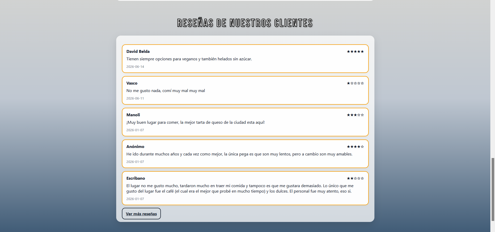

#### Ver todas las reseñas y filtrar
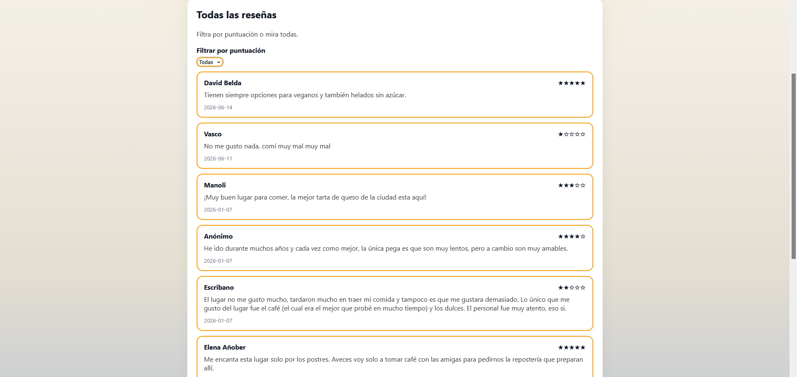

---

## 🎨 Interfaz de los gestores 
* Los gestores y trabajadores pueden ver las siguientes secciones.

## ⚙️ Panel de Administración

La aplicación incorpora una zona privada de gestión destinada a trabajadores autorizados del restaurante.

Desde esta área es posible administrar los distintos elementos de la aplicación mediante una interfaz centralizada y protegida por autenticación.

### Funcionalidades disponibles - sistemas CRUD

* Gestión de trabajadores y roles. (Permite el control, acceso y diferentes permisos según el rol -> jefe, encargado, trabajador)
* Gestión de reservas. (Permite ver reservas del día, quien la realizó, para que turno... además permite crear reservas manuales)
* Gestión de crear platos únicos / carta de restaurante. (Permite crear un plato y añadirlo a la carta) 
* Creación y publicación del menú diario. (Permite gestionar la publicación de los menús del día)
* Gestión de clientes registrados. (Permite visualizar los datos de los clientes registrados de la app)
* Moderación de reseñas de clientes. (Permite moderar el sistema de reseñas interno de la app)
* Configuración del contenido dinámico de la página principal. (Permite crear y editar una frase de cabecera -> "feliz navidad")

#### Panel de control general - opciones disponibles según el rol

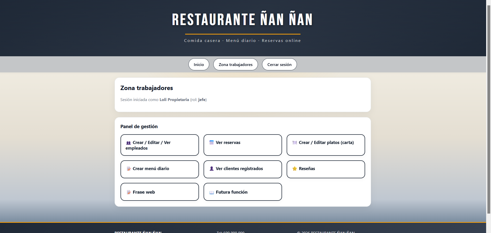

#### Gestión crear trabajador

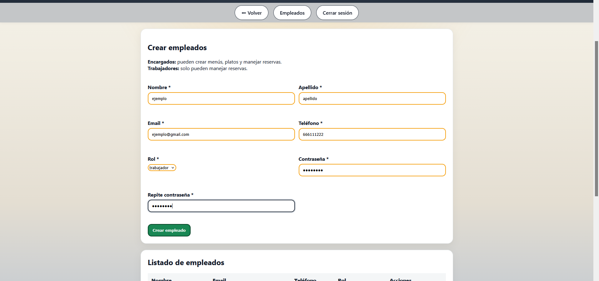

#### Gestión de reservas online - mesas disponibles - reservas manuales

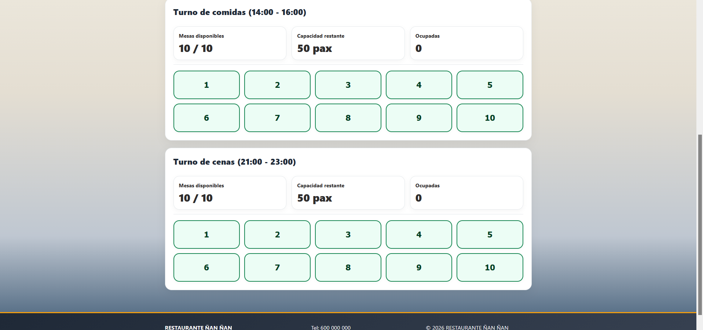

#### Gestión de crear platos de la carta

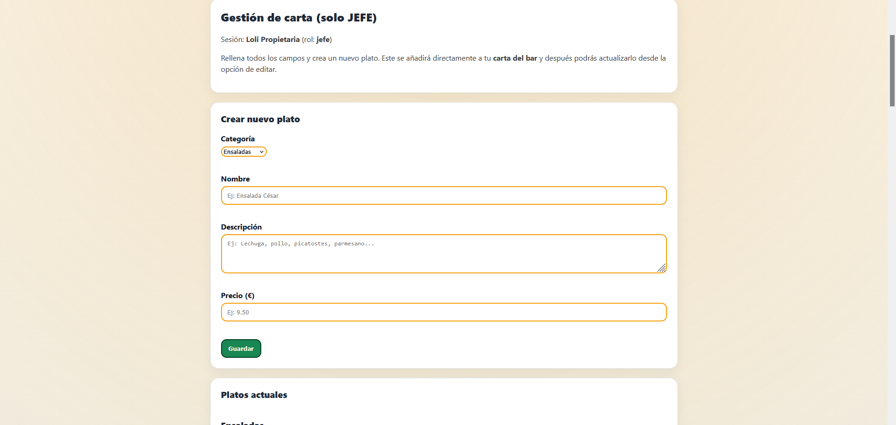

#### Menú diario

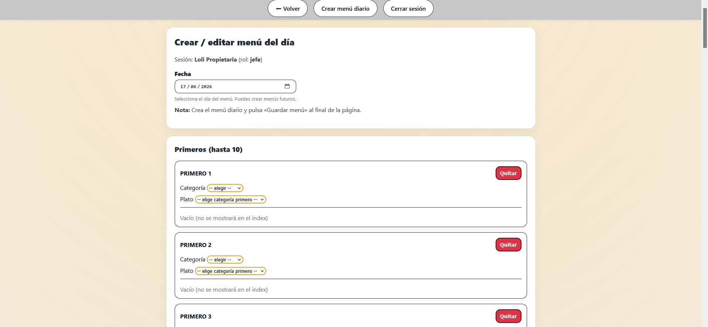

#### Ver clientes registrados en al app

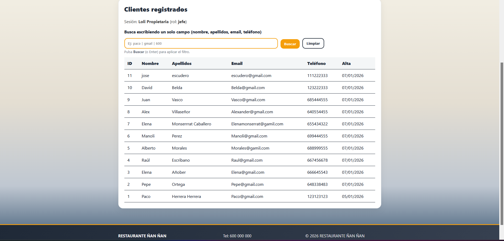

#### Moderación de reseñas

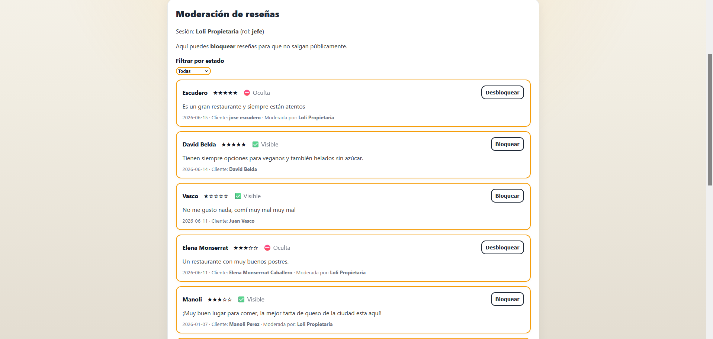

#### Gestión de la frase web

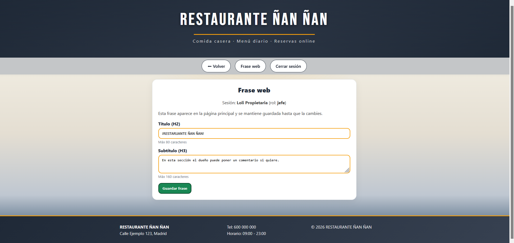

---

## 📱 Responsive

La parte pública de la aplicación ha sido adaptada para dispositivos móviles, permitiendo consultar información del restaurante, registrarse, iniciar sesión y gestionar reservas desde cualquier dispositivo.

La zona de gestión también incluye adaptación responsive para garantizar su funcionamiento en pantallas pequeñas. No obstante, debido al volumen de información y herramientas administrativas disponibles, se recomienda su uso desde un ordenador para una mejor experiencia de usuario.

#### Funcionalidades adaptadas

* Home responsive.
* Login responsive.
* Registro responsive.
* Panel cliente responsive.
* Gestión de reservas responsive.
* Panel de administración responsive.
* Tablas adaptadas para dispositivos móviles.

#### Responsive general de la pagina principal
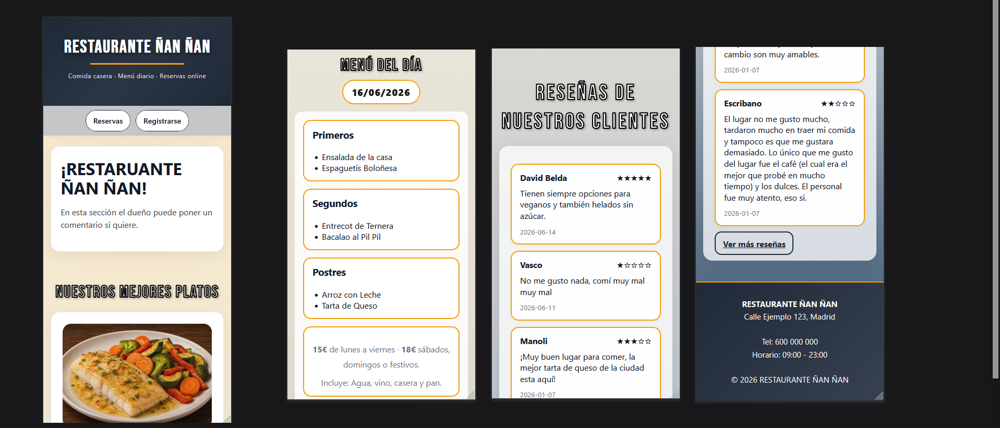

---

## 🛠️ Tecnologías utilizadas

### Backend

* PHP 8
* PDO
* MySQL / MariaDB

### Frontend

* HTML5
* CSS3
* JavaScript ES6

### Herramientas

* XAMPP
* phpMyAdmin
* Git
* GitHub
* Visual Studio Code

---

## 📂 Instalación

### Requisitos

* PHP 8+
* MariaDB o MySQL
* Apache
* XAMPP (recomendado)

### Pasos

1. Clonar repositorio.
2. Importar base de datos.
3. Configurar conexión en:

```text
database/db.php
```

4. Ejecutar servidor Apache y MySQL.
5. Acceder mediante:

```text
http://localhost/BarApp/pages/index.php
```

---

## 🧪 Pruebas realizadas

Se han realizado pruebas manuales sobre:

* Registro de usuarios.
* Inicio de sesión.
* Gestión de reservas.
* Cancelación de reservas.
* Gestión de empleados.
* Gestión de clientes.
* Gestión de platos.
* Gestión de menús.
* Gestión de reseñas.
* Responsive móvil.

---

## 📈 Posibles mejoras futuras

* Notificaciones por correo electrónico.
* Recuperación de contraseña.
* Panel estadístico avanzado.
* Gestión de pedidos online.
* Integración con TPV.
* Dashboard analítico.
* Sistema de promociones.

---

## 🏆 Principales aprendizajes

Durante el desarrollo de este proyecto se han trabajado conceptos como:

* Desarrollo Full Stack con PHP y JavaScript.
* Diseño y modelado de bases de datos relacionales.
* Gestión de sesiones y control de acceso por roles.
* Creación de APIs REST.
* Diseño responsive para dispositivos móviles.
* Gestión de proyectos mediante Git y GitHub.
* Organización modular de aplicaciones web.

---

# 📫 Contacto

📧 Email: **escuderopolojoseluis@gmail.com**

🌐 Portfolio: https://megalol-dev.github.io/

💼 LinkedIn: https://linkedin.com/in/jose-luis-escudero-polo


📺 YouTube: https://www.youtube.com/@Megalol-dev

---

## 📜 Licencia

Proyecto desarrollado con fines de portfolio. Proyecto privado sin autorización para el comercio
