# Restaurante Ñan Ñan

> Aplicación web full stack para la gestión de un restaurante: carta y menú diario, reservas online, reseñas de clientes y panel privado para la operativa del personal.


Restaurante Ñan Ñan centraliza en una misma aplicación la experiencia pública del establecimiento y sus tareas internas. Los visitantes pueden consultar la carta, el menú del día y las reseñas; los clientes registrados pueden reservar mesa, cancelar sus reservas y publicar una valoración; y el personal dispone de herramientas de gestión adaptadas a su rol.

El proyecto está desarrollado sin frameworks de frontend. Las páginas PHP construyen la interfaz y protegen las zonas privadas, mientras que los módulos JavaScript consumen una API JSON interna mediante `fetch`. La lógica de negocio y el acceso a MariaDB se resuelven en el servidor con PHP, sesiones y consultas preparadas mediante PDO.

## Índice

- [Vista de la aplicación](#vista-de-la-aplicación)
- [Funcionalidades](#funcionalidades)
- [Arquitectura](#arquitectura)
- [Flujo de autenticación](#flujo-de-autenticación)
- [Lógica de reservas](#lógica-de-reservas)
- [Carta y menú diario](#carta-y-menú-diario)
- [Sistema de reseñas](#sistema-de-reseñas)
- [Modelo de datos](#modelo-de-datos)
- [Decisiones técnicas](#decisiones-técnicas)
- [Backend y API interna](#backend-y-api-interna)
- [Frontend](#frontend)
- [Seguridad y permisos](#seguridad-y-permisos)
- [Tecnologías](#tecnologías)
- [Ejecución local](#ejecución-local)
- [Pruebas](#pruebas)
- [Qué demuestra este proyecto](#qué-demuestra-este-proyecto)
- [Evolución prevista](#evolución-prevista)
- [Licencia](#licencia)
- [Autor y contacto](#-autor-y-contacto)

## Vista de la aplicación

### Página principal

La portada reúne el mensaje del restaurante, un carrusel de platos, el menú publicado para el día actual y las reseñas más recientes.

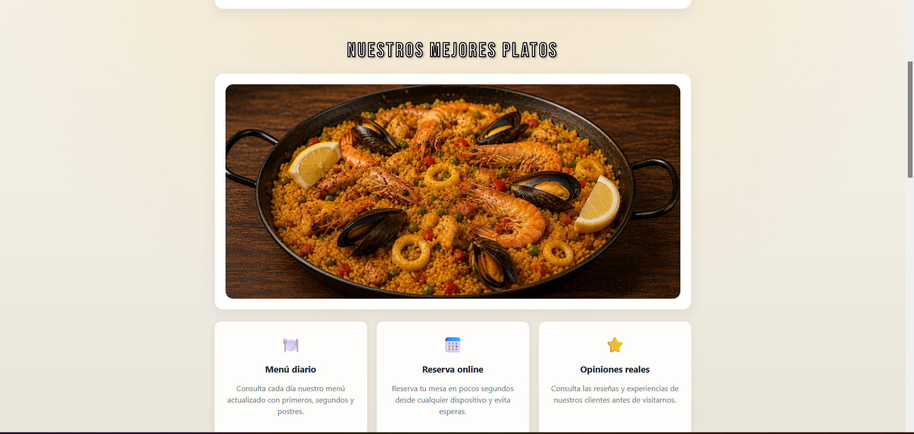

### Menú diario y carta

El menú del día se obtiene dinámicamente desde la API según la fecha actual. La carta presenta los platos disponibles organizados por categorías.

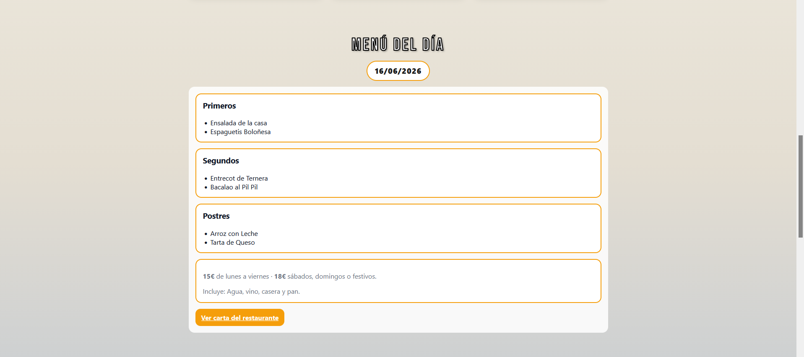

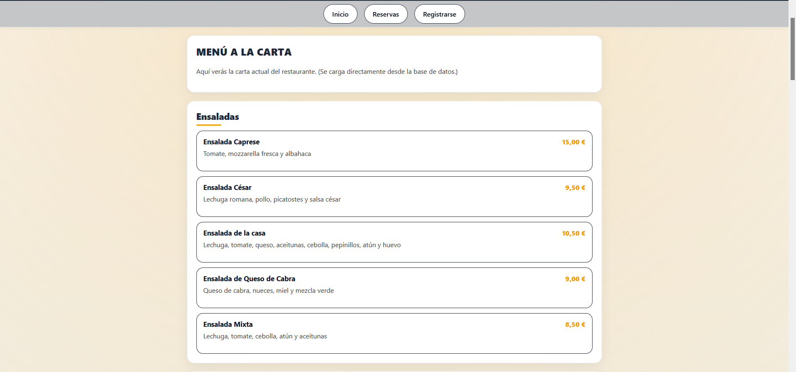

### Reseñas públicas

La página principal muestra las últimas opiniones visibles. Desde la vista completa se pueden consultar y filtrar las reseñas por puntuación.

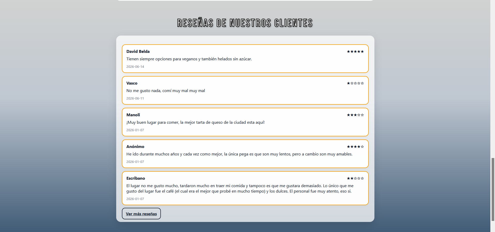

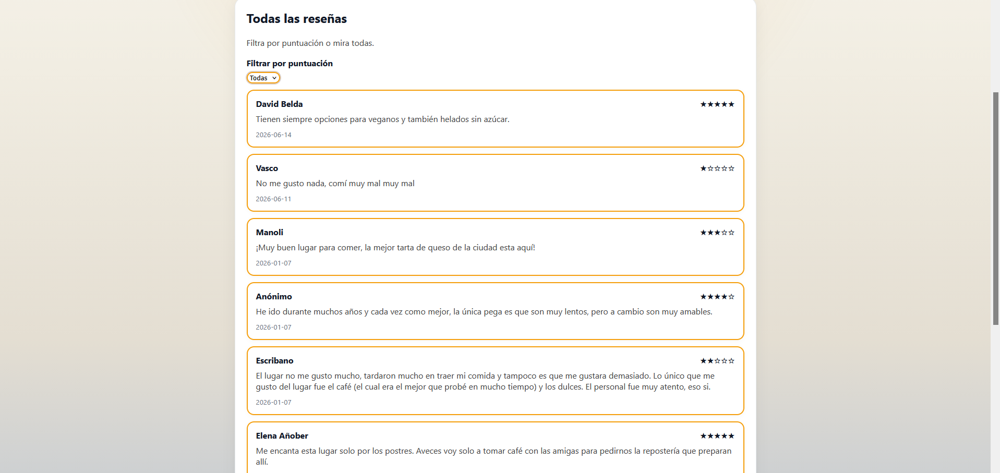

### Acceso y zona del cliente

Clientes y trabajadores utilizan el mismo formulario de acceso. Después de autenticar las credenciales, el servidor identifica el tipo de usuario y redirige a su zona correspondiente.

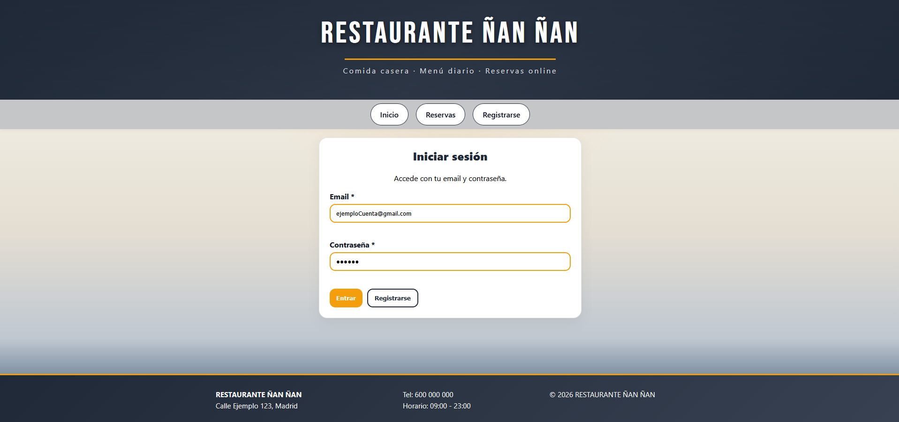

El cliente puede consultar la disponibilidad, crear o cancelar reservas y mantener su propia reseña.

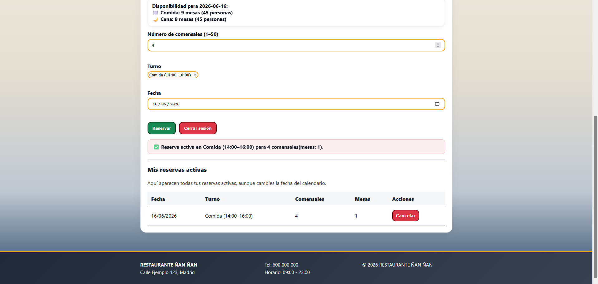

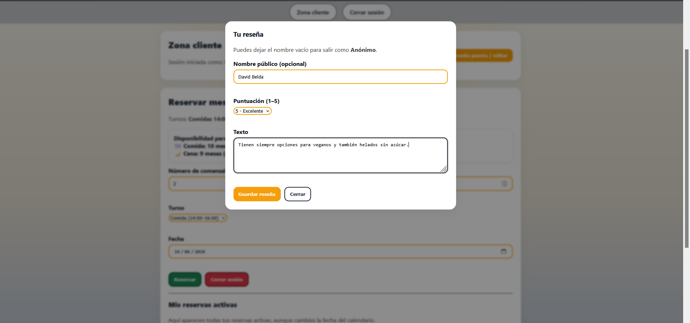

### Panel de trabajadores

El panel muestra las herramientas disponibles según el rol de la sesión.

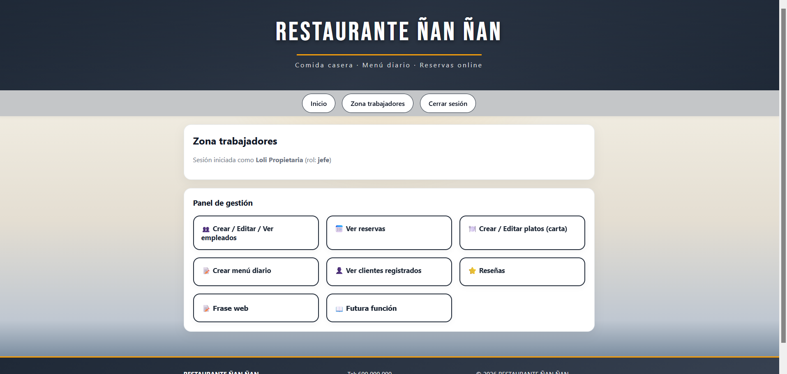

#### Gestión de empleados

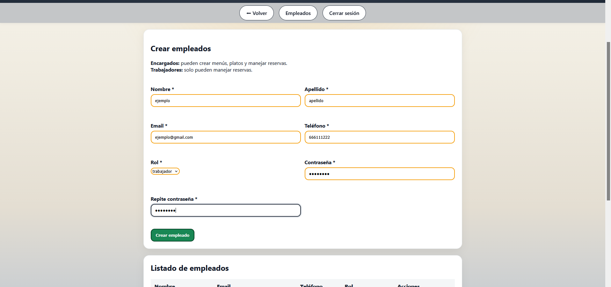

#### Gestión de reservas y mesas

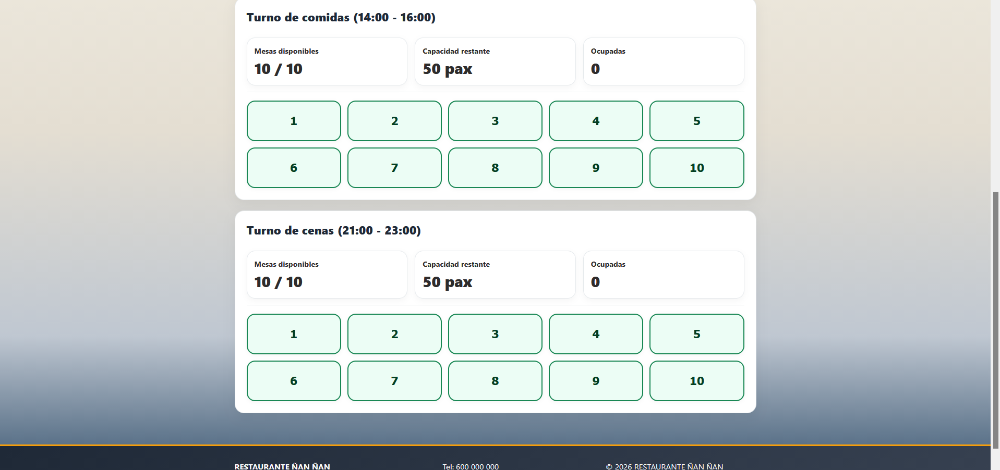

#### Gestión de platos

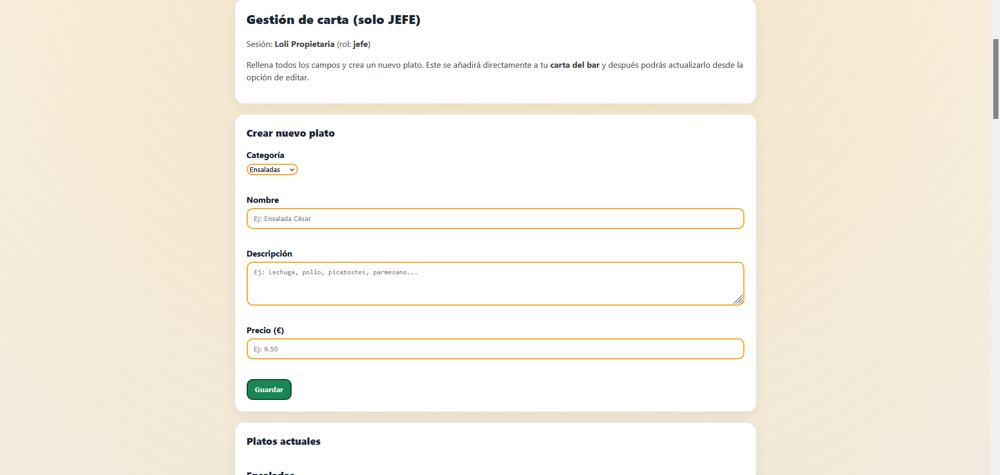

#### Creación del menú diario

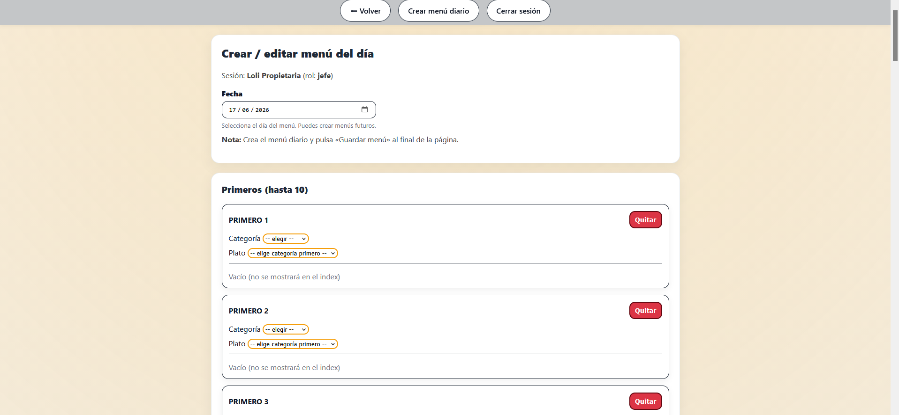

#### Consulta de clientes

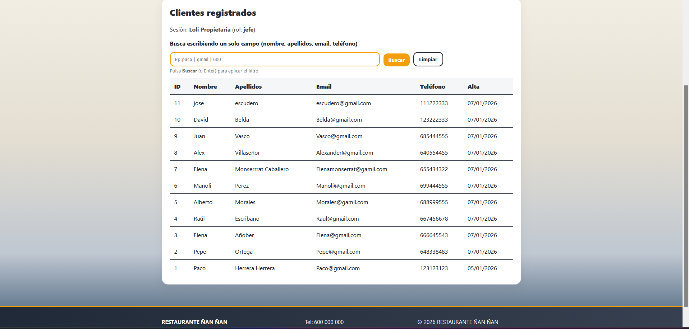

#### Moderación de reseñas

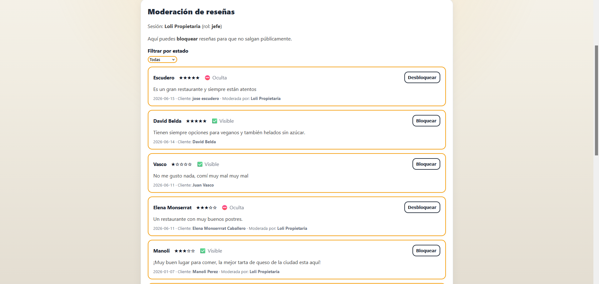

#### Contenido dinámico de la portada

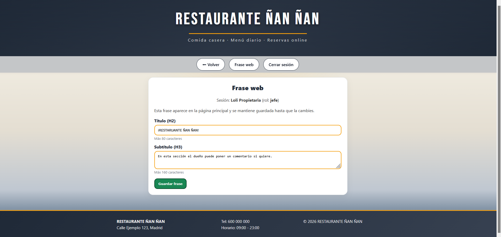

### Diseño responsive

La zona pública, la autenticación, el área del cliente y las pantallas de gestión incluyen adaptación para dispositivos móviles. Para las tablas y herramientas administrativas se recomienda una pantalla de escritorio.

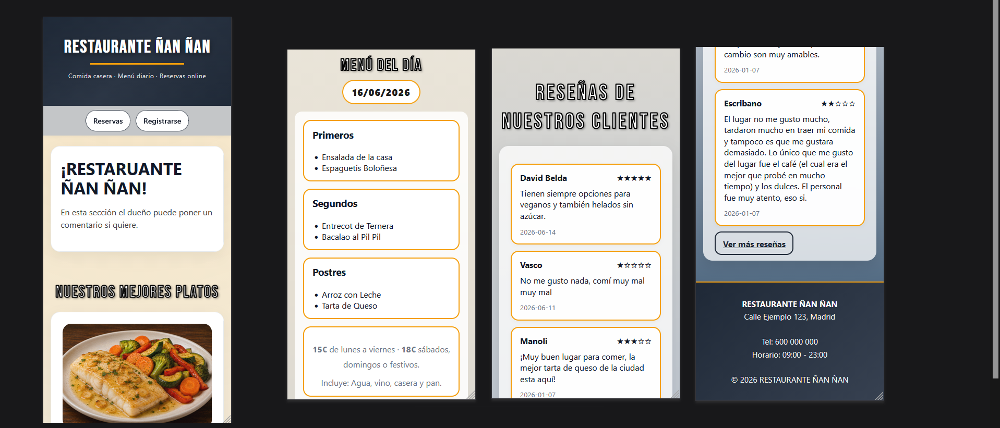

## Funcionalidades

### Experiencia pública

- Portada con frase configurable por el responsable del restaurante.
- Carrusel automático con platos destacados.
- Consulta del menú correspondiente al día actual.
- Carta completa agrupada por categorías.
- Últimas reseñas visibles en la página principal.
- Página con todas las reseñas y filtro por puntuación.
- Registro e inicio de sesión desde una interfaz responsive.

### Área del cliente

- Registro con nombre, apellidos, correo, teléfono y contraseña.
- Inicio y cierre de sesión.
- Consulta de plazas disponibles por fecha y turno.
- Reserva online para entre 1 y 50 comensales.
- Asignación automática de las mesas necesarias.
- Consulta de todas las reservas activas propias.
- Cancelación segura de una reserva propia.
- Creación y edición de una reseña por cliente.
- Aviso cuando una reseña ha sido ocultada o puesta en revisión.

### Operativa interna

- Panel de herramientas condicionado por el rol del trabajador.
- Vista de ocupación por fecha y turno.
- Creación de reservas manuales para llamadas o clientes presenciales.
- Liberación de mesas mediante la cancelación de la reserva asociada.
- Consulta y búsqueda de clientes registrados.
- Alta, edición y eliminación de empleados autorizados.
- Alta, edición y eliminación de platos de la carta.
- Composición del menú de cualquier fecha con platos existentes.
- Moderación de reseñas mediante estados.
- Edición del título y subtítulo dinámicos de la portada.

### Reglas de negocio principales

| Regla | Implementación |
|---|---|
| Capacidad | El restaurante trabaja con 10 mesas de 5 plazas, hasta 50 comensales por turno. |
| Mesas necesarias | Se calculan con `ceil(comensales / 5)`. Una reserva de 7 personas ocupa 2 mesas. |
| Turnos | Se distinguen `comida` y `cena`; ambos mantienen ocupación independiente para una misma fecha. |
| Fechas pasadas | El servidor impide crear reservas online para días anteriores al actual. |
| Límite para hoy | Comida deja de admitirse a las 15:00 y cena a las 22:00 cuando la reserva es para el mismo día. |
| Fechas futuras | Pueden reservarse a cualquier hora siempre que exista capacidad. |
| Reserva duplicada | Cada cliente solo puede tener una reserva activa por fecha y turno. |
| Reservas manuales | El personal puede registrar reservas sin aplicar la ventana horaria del canal online. |
| Cancelación | La reserva pasa a estado `cancelada`; así deja de ocupar mesas sin perderse el registro. |
| Menú diario | Admite hasta 10 posiciones para primeros, 10 para segundos y 10 para postres. |
| Reseña de cliente | Cada cliente conserva una única reseña, que puede crear o actualizar. |
| Moderación | Una reseña puede estar `visible`, `oculta` o `en_revision`. Solo las visibles aparecen públicamente. |

## Arquitectura

La aplicación sigue una arquitectura cliente-servidor sencilla. Las vistas PHP componen las páginas y validan el acceso inicial; los módulos JavaScript controlan la interacción y envían comandos JSON a las APIs; y las APIs aplican permisos, reglas de negocio y persistencia.

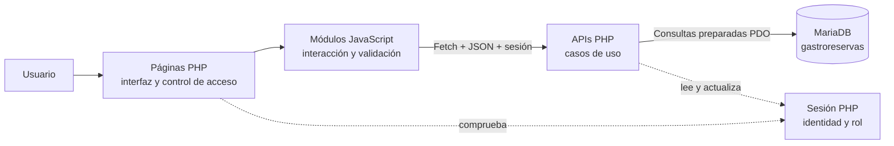
```mermaid
flowchart LR
    U[Usuario] --> P[Páginas PHP<br/>interfaz y control de acceso]
    P --> JS[Módulos JavaScript<br/>interacción y validación]
    JS -->|Fetch + JSON + sesión| API[APIs PHP<br/>casos de uso]
    API -->|Consultas preparadas PDO| DB[(MariaDB<br/>gastroreservas)]
    API -. lee y actualiza .-> S[Sesión PHP<br/>identidad y rol]
    P -. comprueba .-> S
```

| Capa | Responsabilidad |
|---|---|
| Páginas | Renderizan las vistas públicas y privadas e incluyen los componentes compartidos. |
| Componentes | Centralizan la cabecera, el pie, los recursos globales y scripts comunes. |
| JavaScript | Valida formularios, actualiza la interfaz y consume la API con `fetch`. |
| API PHP | Interpreta la acción solicitada, comprueba permisos y ejecuta la lógica de negocio. |
| Persistencia | `database/db.php` crea la conexión PDO con MariaDB y activa el modo de excepciones. |
| Sesión | Conserva el tipo de usuario, identificadores, nombre, correo y rol autenticado. |

### Estructura del repositorio

```text
BarApp/
├── api/
│   ├── clientes_api.php
│   ├── empleados_api.php
│   ├── frase_web_api.php
│   ├── login_api.php
│   ├── menu_diario_api.php
│   ├── platos_api.php
│   ├── registro_api.php
│   ├── reservas_api.php
│   └── resenas_api.php
├── assets/
│   ├── css/
│   │   └── styles.css
│   ├── img/
│   │   ├── carrusel/
│   │   └── readme/
│   └── js/
│       ├── components/ui.js
│       └── módulos por funcionalidad
├── components/
│   ├── header.php
│   └── footer.php
├── database/
│   └── db.php
├── docs/
│   ├── Documentación/
│   └── migracion/
└── pages/
    ├── index.php
    ├── login.php
    ├── registro.php
    ├── panel_cliente.php
    ├── zona_trabajadores.php
    └── páginas públicas y de gestión
```

## Flujo de autenticación

El acceso de clientes y trabajadores se resuelve desde un único formulario. El servidor busca primero el correo en trabajadores y después en clientes, verifica el hash y crea una sesión con los datos necesarios para autorizar las siguientes peticiones.

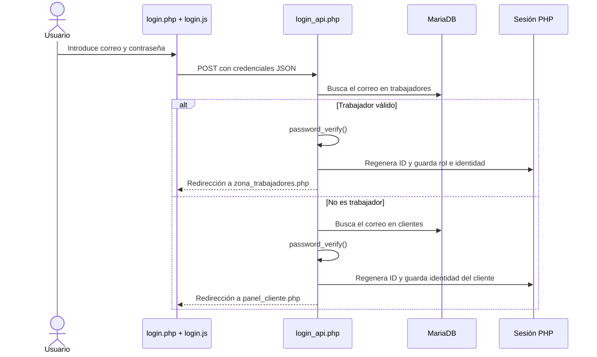
```mermaid
sequenceDiagram
    actor Usuario
    participant Web as login.php + login.js
    participant API as login_api.php
    participant DB as MariaDB
    participant Sesion as Sesión PHP

    Usuario->>Web: Introduce correo y contraseña
    Web->>API: POST con credenciales JSON
    API->>DB: Busca el correo en trabajadores
    alt Trabajador válido
        API->>API: password_verify()
        API->>Sesion: Regenera ID y guarda rol e identidad
        API-->>Web: Redirección a zona_trabajadores.php
    else No es trabajador
        API->>DB: Busca el correo en clientes
        API->>API: password_verify()
        API->>Sesion: Regenera ID y guarda identidad del cliente
        API-->>Web: Redirección a panel_cliente.php
    end
```

Las contraseñas nuevas se almacenan con `password_hash()` y nunca se comparan directamente. `logout.php` vacía la sesión, destruye sus datos y devuelve al usuario a la página principal.

## Lógica de reservas

### Capacidad y asignación

Las mesas se identifican del 1 al 10 y cada una representa cinco plazas. Tanto el canal online como el panel de trabajadores calculan cuántas mesas requiere el grupo y buscan identificadores libres para la fecha y el turno solicitados.

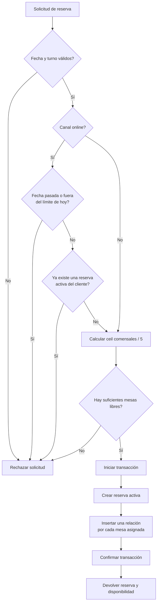
```mermaid
flowchart TD
    A[Solicitud de reserva] --> B{Fecha y turno válidos?}
    B -- No --> X[Rechazar solicitud]
    B -- Sí --> C{Canal online?}
    C -- Sí --> D{Fecha pasada o fuera<br/>del límite de hoy?}
    D -- Sí --> X
    D -- No --> E{Ya existe una reserva<br/>activa del cliente?}
    E -- Sí --> X
    E -- No --> F[Calcular ceil comensales / 5]
    C -- No --> F
    F --> G{Hay suficientes mesas libres?}
    G -- No --> X
    G -- Sí --> H[Iniciar transacción]
    H --> I[Crear reserva activa]
    I --> J[Insertar una relación<br/>por cada mesa asignada]
    J --> K[Confirmar transacción]
    K --> L[Devolver reserva y disponibilidad]
```

La creación de la reserva y las relaciones con sus mesas se ejecuta dentro de una transacción. Si falla cualquier inserción, se revierte la operación para evitar una reserva incompleta.

### Canales de reserva

| Canal | Quién lo utiliza | Particularidades |
|---|---|---|
| `online` | Cliente autenticado | Aplica fechas, límites horarios, propiedad y reserva única por turno. |
| `manual` | Trabajador autenticado | Permite atender llamadas, llegadas presenciales y ajustes internos sin límite horario. |

### Consulta y liberación

- `resumen_dia` calcula ocupación, mesas disponibles y capacidad restante para comida y cena.
- `state` devuelve al trabajador el detalle de las mesas ocupadas para una fecha y turno.
- `cliente_listar` recupera todas las reservas activas del cliente, independientemente de la fecha seleccionada en el formulario.
- Al cancelar o liberar una mesa se cancela la reserva completa vinculada, incluidas todas las mesas que ocupaba.
- Las consultas de ocupación solo tienen en cuenta reservas con estado `activa`.

## Carta y menú diario

Los platos son la fuente reutilizable para la carta y para la composición de menús diarios.

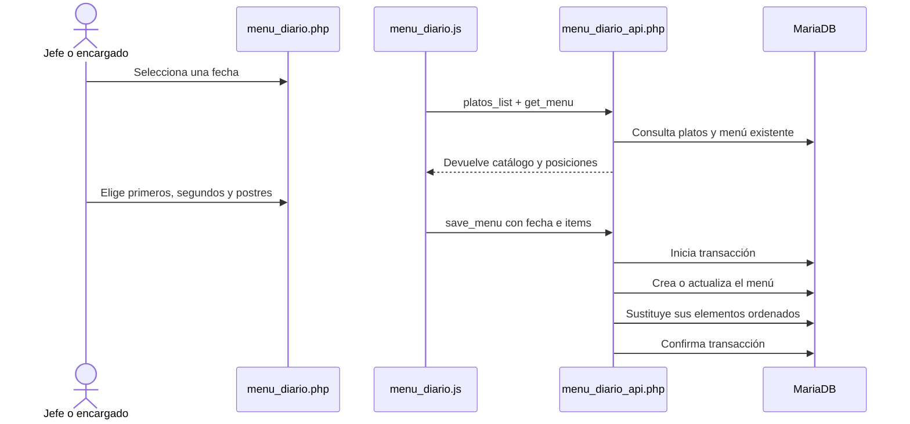
```mermaid
sequenceDiagram
    actor Gestor as Jefe o encargado
    participant Panel as menu_diario.php
    participant JS as menu_diario.js
    participant API as menu_diario_api.php
    participant DB as MariaDB

    Gestor->>Panel: Selecciona una fecha
    JS->>API: platos_list + get_menu
    API->>DB: Consulta platos y menú existente
    API-->>JS: Devuelve catálogo y posiciones
    Gestor->>Panel: Elige primeros, segundos y postres
    JS->>API: save_menu con fecha e items
    API->>DB: Inicia transacción
    API->>DB: Crea o actualiza el menú
    API->>DB: Sustituye sus elementos ordenados
    API->>DB: Confirma transacción
```

### Platos

La carta admite las categorías `Ensaladas`, `Carnes`, `Pescados`, `Pasta`, `Bocadillos`, `Sandwiches`, `Postres` y `Bebidas`. Cada plato guarda nombre, descripción, precio y estado activo. El precio se normaliza para aceptar coma o punto decimal y debe estar entre 0 y 999 euros, sin incluir los extremos inválidos.

### Menú por fecha

- Cada fecha puede tener un único registro de menú.
- Los elementos se clasifican como `primero`, `segundo` o `postre`.
- Cada grupo dispone de posiciones ordenadas del 1 al 10.
- Guardar un menú existente reemplaza sus elementos dentro de una transacción.
- El menú puede vaciarse por completo.
- La consulta pública devuelve el menú de la fecha solicitada y el texto fijo de bebidas y pan incluidos.
- Si no hay menú para ese día, la API devuelve correctamente un menú inexistente en lugar de reutilizar otro.

## Sistema de reseñas

Cada cliente puede mantener una única reseña asociada a su cuenta. Puede indicar un nombre público opcional, elegir una puntuación entre 1 y 5 y escribir un comentario de entre 5 y 1000 caracteres.

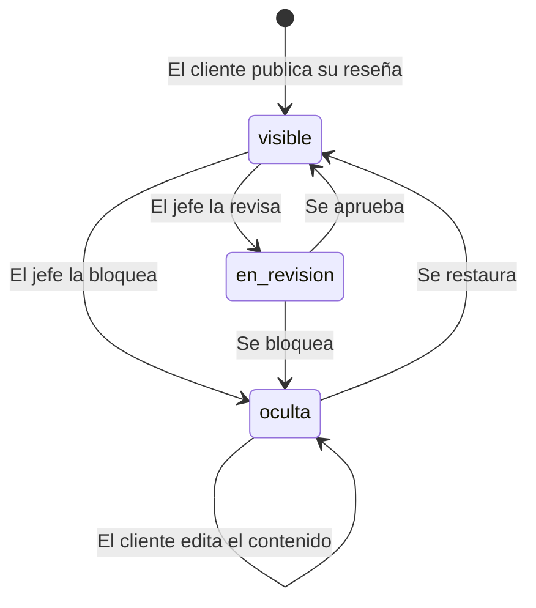
```mermaid
stateDiagram-v2
    [*] --> visible: El cliente publica su reseña
    visible --> oculta: El jefe la bloquea
    visible --> en_revision: El jefe la revisa
    en_revision --> visible: Se aprueba
    en_revision --> oculta: Se bloquea
    oculta --> visible: Se restaura
    oculta --> oculta: El cliente edita el contenido
```

- Solo las reseñas `visible` se muestran en la portada y en el listado público.
- El listado público se puede filtrar por puntuación.
- El nombre público es opcional y está limitado a 40 caracteres.
- Si el cliente edita una reseña moderada, su estado no cambia automáticamente.
- La moderación registra el nombre del responsable y la fecha de la acción.
- El panel del jefe permite filtrar por estado y cambiarlo entre `visible`, `oculta` y `en_revision`.

## Modelo de datos

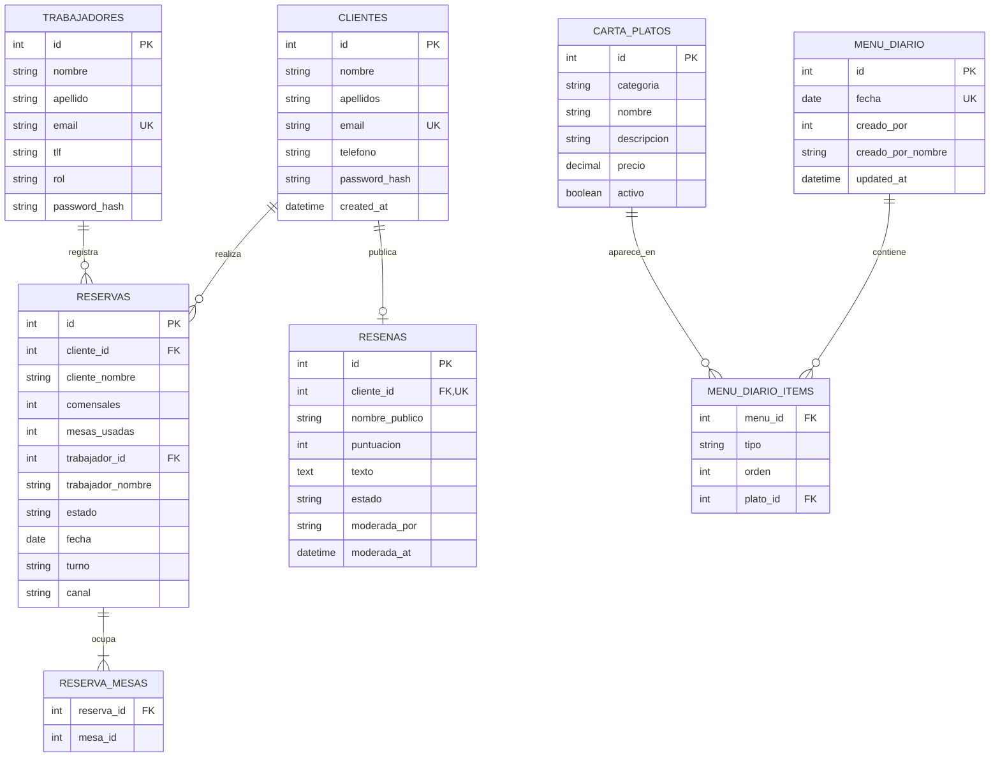
```mermaid
erDiagram
    CLIENTES ||--o{ RESERVAS : realiza
    CLIENTES ||--o| RESENAS : publica
    TRABAJADORES ||--o{ RESERVAS : registra
    RESERVAS ||--|{ RESERVA_MESAS : ocupa
    MENU_DIARIO ||--o{ MENU_DIARIO_ITEMS : contiene
    CARTA_PLATOS ||--o{ MENU_DIARIO_ITEMS : aparece_en

    CLIENTES {
        int id PK
        string nombre
        string apellidos
        string email UK
        string telefono
        string password_hash
        datetime created_at
    }

    TRABAJADORES {
        int id PK
        string nombre
        string apellido
        string email UK
        string tlf
        string rol
        string password_hash
    }

    RESERVAS {
        int id PK
        int cliente_id FK
        string cliente_nombre
        int comensales
        int mesas_usadas
        int trabajador_id FK
        string trabajador_nombre
        string estado
        date fecha
        string turno
        string canal
    }

    RESERVA_MESAS {
        int reserva_id FK
        int mesa_id
    }

    CARTA_PLATOS {
        int id PK
        string categoria
        string nombre
        string descripcion
        decimal precio
        boolean activo
    }

    MENU_DIARIO {
        int id PK
        date fecha UK
        int creado_por
        string creado_por_nombre
        datetime updated_at
    }

    MENU_DIARIO_ITEMS {
        int menu_id FK
        string tipo
        int orden
        int plato_id FK
    }

    RESENAS {
        int id PK
        int cliente_id FK,UK
        string nombre_publico
        int puntuacion
        text texto
        string estado
        string moderada_por
        datetime moderada_at
    }
```

`WEB_FRASE` es una configuración independiente de registro único (`id = 1`) que conserva el título, subtítulo y fecha de actualización de la portada.

### Relaciones importantes

- Una reserva puede ocupar varias mesas mediante `reserva_mesas`.
- Una reserva manual puede no estar vinculada a un cliente registrado; conserva el nombre introducido por el trabajador.
- `cliente_nombre` y `trabajador_nombre` guardan el texto que debe mostrarse en la operativa.
- Un plato puede aparecer en múltiples menús y cada menú ordena sus elementos por tipo y posición.
- La restricción única de `cliente_id` en reseñas garantiza una opinión editable por cuenta.

## Decisiones técnicas

### API basada en acciones

Todos los endpoints internos reciben peticiones `POST` con JSON. El campo `action` selecciona el caso de uso dentro del módulo correspondiente. Esta solución mantiene agrupadas las operaciones de un mismo dominio y simplifica su consumo desde JavaScript sin incorporar un router externo.

### Sesiones para identidad y roles

La aplicación se sirve desde el mismo entorno PHP, por lo que una sesión del servidor resulta suficiente para conservar la identidad. Al iniciar sesión se regenera el identificador y se guardan únicamente los datos necesarios para dirigir al usuario y autorizar las APIs.

### Validación en cliente y servidor

JavaScript ofrece mensajes inmediatos en los formularios, pero las reglas importantes vuelven a comprobarse en PHP. El servidor valida métodos HTTP, JSON, formatos, rangos, fechas, permisos y propiedad de los recursos antes de escribir en la base de datos.

### Consultas preparadas y transacciones

Los valores de usuario se envían mediante sentencias preparadas PDO. Las operaciones compuestas —asignación de mesas y sustitución de los elementos de un menú— utilizan transacciones para mantener la consistencia si se produce un error intermedio.

### Cancelación lógica de reservas

Liberar una reserva cambia su estado a `cancelada` en lugar de borrar el registro. Las consultas de disponibilidad filtran por reservas activas, de modo que las mesas se recuperan y el historial básico permanece disponible.

### Contenido público gestionable

El menú diario, las reseñas y la frase de portada proceden de la base de datos. La página pública se mantiene actualizada sin editar directamente su HTML y el personal puede operar desde sus paneles privados.

### Separación del JavaScript por responsabilidad

Cada pantalla carga el módulo que necesita: reservas, platos, empleados, menús, reseñas o autenticación. `assets/js/components/ui.js` concentra utilidades compartidas de interfaz y avisos.

## Backend y API interna

### Módulos PHP

| Archivo | Responsabilidad |
|---|---|
| `database/db.php` | Construye la conexión PDO con la base de datos `gastroreservas`. |
| `api/login_api.php` | Autentica clientes y trabajadores, crea la sesión y decide la redirección. |
| `api/registro_api.php` | Valida y registra nuevas cuentas de cliente. |
| `api/reservas_api.php` | Calcula disponibilidad, asigna mesas y gestiona reservas online y manuales. |
| `api/resenas_api.php` | Publica, consulta, actualiza y modera reseñas. |
| `api/platos_api.php` | Gestiona los platos de la carta. |
| `api/menu_diario_api.php` | Consulta y edita menús asociados a una fecha. |
| `api/clientes_api.php` | Lista y busca clientes para el panel interno. |
| `api/empleados_api.php` | Crea, edita y elimina trabajadores protegidos por rol. |
| `api/frase_web_api.php` | Consulta y actualiza el contenido principal de la portada. |

### Contrato de acciones

Todos los endpoints de la tabla utilizan `POST` y cuerpos JSON.

| Endpoint | Acción | Acceso | Finalidad |
|---|---|---|---|
| `login_api.php` | Sin acción | Público | Autenticar un correo y crear la sesión. |
| `registro_api.php` | Sin acción | Público | Registrar una cuenta de cliente. |
| `reservas_api.php` | `resumen_dia` | Público | Consultar capacidad de comida y cena para una fecha. |
| `reservas_api.php` | `cliente_listar` | Cliente | Obtener las reservas activas propias. |
| `reservas_api.php` | `cliente_mi_reserva` | Cliente | Consultar la reserva propia para una fecha y turno. |
| `reservas_api.php` | `cliente_reservar` | Cliente | Crear una reserva online y asignar mesas. |
| `reservas_api.php` | `cliente_cancelar` | Cliente propietario | Cancelar una reserva activa propia. |
| `reservas_api.php` | `state` | Trabajador | Obtener el mapa de ocupación de un turno. |
| `reservas_api.php` | `ocupar` | Trabajador | Crear una reserva manual. |
| `reservas_api.php` | `liberar` | Trabajador | Cancelar la reserva asociada a una mesa. |
| `resenas_api.php` | `latest` | Público | Cargar las últimas reseñas visibles. |
| `resenas_api.php` | `list_all` | Público | Listar reseñas visibles con filtro opcional. |
| `resenas_api.php` | `my_get` | Cliente | Consultar la reseña propia. |
| `resenas_api.php` | `my_save` | Cliente | Crear o actualizar la reseña propia. |
| `resenas_api.php` | `admin_list` | Jefe | Listar reseñas por estado. |
| `resenas_api.php` | `admin_set_estado` | Jefe | Moderar una reseña. |
| `menu_diario_api.php` | `public_get` | Público | Obtener el menú de una fecha. |
| `menu_diario_api.php` | `platos_list` | Jefe/encargado | Obtener platos para componer el menú. |
| `menu_diario_api.php` | `get_menu` | Jefe/encargado | Cargar un menú para editarlo. |
| `menu_diario_api.php` | `save_menu` | Jefe/encargado | Crear o reemplazar un menú. |
| `menu_diario_api.php` | `clear_menu` | Jefe/encargado | Eliminar el menú de una fecha. |
| `platos_api.php` | `list` | Jefe | Listar platos en el gestor. |
| `platos_api.php` | `create` | Jefe | Crear un plato. |
| `platos_api.php` | `update` | Jefe | Editar un plato. |
| `platos_api.php` | `delete` | Jefe | Eliminar un plato. |
| `clientes_api.php` | `list` | Trabajador | Mostrar clientes, con límite de 500. |
| `clientes_api.php` | `search` | Trabajador | Buscar por nombre, apellidos, correo o teléfono. |
| `empleados_api.php` | `create` | Jefe/encargado en API | Crear un trabajador o encargado. |
| `empleados_api.php` | `update` | Jefe/encargado en API | Editar datos y rol, excepto los del jefe. |
| `empleados_api.php` | `delete` | Jefe/encargado en API | Eliminar un empleado, excepto al jefe. |
| `frase_web_api.php` | `get` | Público | Obtener el título y subtítulo de portada. |
| `frase_web_api.php` | `set` | Jefe | Actualizar la frase web. |

> La navegación y la página de empleados se muestran únicamente al jefe. El endpoint de empleados acepta actualmente sesiones de jefe o encargado; la tabla refleja el comportamiento real del código.

### Respuestas y errores

Las APIs devuelven JSON con una propiedad `ok`. Cuando una operación falla, incluyen `error` y utilizan códigos HTTP como:

- `400` para JSON o acciones inválidas.
- `401` cuando falta una sesión válida.
- `403` cuando el usuario no tiene permisos o no es propietario.
- `404` cuando el recurso no existe.
- `405` para métodos HTTP distintos de `POST`.
- `409` para conflictos de negocio, como falta de mesas o correos duplicados.
- `422` para datos que no superan la validación.
- `500` para errores internos no recuperables.

## Frontend

| Archivo o área | Responsabilidad |
|---|---|
| `pages/index.php` | Portada, carrusel, menú actual, carta destacada y últimas reseñas. |
| `pages/login.php` y `assets/js/login.js` | Autenticación y redirección según el tipo de usuario. |
| `pages/registro.php` y `assets/js/registro.js` | Formulario, validación y alta de clientes. |
| `pages/panel_cliente.php` y `assets/js/zona_cliente.js` | Disponibilidad, creación, listado y cancelación de reservas. |
| `assets/js/resena_cliente.js` | Creación y edición de la reseña personal. |
| `pages/ver_reservas.php` y `assets/js/ver_reservas.js` | Mapa operativo de mesas y reservas manuales. |
| `pages/platos.php` y `assets/js/platos.js` | CRUD de platos de la carta. |
| `pages/menu_diario.php` y `assets/js/menu_diario.js` | Composición del menú por fecha. |
| `pages/empleados.php` y `assets/js/empleados.js` | Alta, edición y eliminación de empleados. |
| `pages/clientes.php` y `assets/js/clientes.js` | Consulta y búsqueda de clientes. |
| `pages/resenas_admin.php` y `assets/js/resenas_admin.js` | Moderación de opiniones. |
| `pages/frase_web.php` y `assets/js/frase_web.js` | Edición de la frase principal. |
| `assets/js/index_menu.js` | Carga del menú actual en la portada. |
| `assets/js/index_resenas.js` | Carga de las últimas reseñas visibles. |
| `assets/js/carrusel.js` | Rotación automática de imágenes destacadas. |
| `assets/js/components/ui.js` | Utilidades visuales reutilizables. |

## Seguridad y permisos

- Contraseñas almacenadas mediante `password_hash()` y verificadas con `password_verify()`.
- Regeneración del identificador de sesión después de autenticar correctamente.
- Protección de páginas privadas mediante comprobaciones de `$_SESSION` y redirección.
- Autorización adicional dentro de las APIs antes de ejecutar operaciones sensibles.
- Consultas preparadas PDO para los valores procedentes del usuario.
- Validación duplicada en navegador y servidor.
- Comprobación de la propiedad antes de cancelar reservas o consultar datos privados.
- Respuestas diferenciadas para autenticación, permisos, validación y conflictos.
- Escape con `htmlspecialchars()` al imprimir datos de sesión en las vistas PHP.

| Recurso | Cliente | Trabajador | Encargado | Jefe |
|---|:---:|:---:|:---:|:---:|
| Carta, menú y reseñas visibles | Sí | Sí | Sí | Sí |
| Reservas propias y reseña propia | Sí | No | No | No |
| Mapa de mesas y reservas manuales | No | Sí | Sí | Sí |
| Consulta de clientes | No | Sí | Sí | Sí |
| Creación del menú diario | No | No | Sí | Sí |
| Gestión de platos | No | No | No | Sí |
| Moderación de reseñas | No | No | No | Sí |
| Edición de la frase web | No | No | No | Sí |
| Página de gestión de empleados | No | No | No | Sí |

> La configuración está orientada a desarrollo local. Para producción se deben usar HTTPS, cookies de sesión seguras, protección CSRF, gestión externa de secretos, mensajes de error no reveladores y una política de cabeceras de seguridad.

## Tecnologías

| Área | Tecnología | Uso |
|---|---|---|
| Backend | PHP 8 | Sesiones, validaciones, reglas de negocio y endpoints JSON. |
| Persistencia | PDO | Consultas preparadas y transacciones. |
| Base de datos | MySQL / MariaDB | Clientes, trabajadores, reservas, carta, menús, reseñas y configuración. |
| Estructura | HTML5 + PHP | Vistas públicas y paneles privados. |
| Estilos | CSS3 | Diseño global, componentes y adaptación responsive. |
| Interacción | JavaScript ES6 | Formularios, peticiones `fetch`, modales, tablas y actualizaciones dinámicas. |
| Servidor local | Apache | Servicio de las páginas y APIs PHP. |
| Entorno | XAMPP | Ejecución conjunta de Apache, PHP y MariaDB. |
| Control de versiones | Git y GitHub | Historial y publicación del proyecto. |

## Ejecución local

### Requisitos

- PHP 8 o superior.
- Apache.
- MySQL o MariaDB.
- Extensiones PDO y PDO MySQL habilitadas.
- XAMPP como entorno recomendado.

### 1. Situar el proyecto

El directorio debe estar dentro de la carpeta pública de XAMPP:

```text
C:\xampp\htdocs\BarApp
```

Las rutas del frontend utilizan `/BarApp/`, por lo que conviene mantener ese nombre de carpeta o actualizar las rutas absolutas de los módulos JavaScript.

### 2. Preparar la base de datos

La conexión espera una base de datos denominada `gastroreservas`:

```sql
CREATE DATABASE gastroreservas
    CHARACTER SET utf8mb4
    COLLATE utf8mb4_unicode_ci;
```

El proyecto necesita las tablas descritas en el [modelo de datos](#modelo-de-datos). El archivo `docs/migracion/gastroreservas.db` es un recurso de migración SQLite y no sustituye a la base MariaDB utilizada en ejecución.

> El repositorio no incluye actualmente un volcado MySQL completo. Para reproducir una instalación nueva debe incorporarse o importarse un esquema compatible antes de iniciar la aplicación.

### 3. Configurar la conexión

Revisa `database/db.php` y adapta host, nombre de base de datos, usuario y contraseña a tu instalación local. No publiques credenciales reales ni archivos de contraseñas en el repositorio.

### 4. Iniciar los servicios

Desde el panel de XAMPP, inicia:

- Apache.
- MySQL.

### 5. Abrir la aplicación

```text
http://localhost/BarApp/pages/index.php
```

## Pruebas

El proyecto se ha validado principalmente mediante pruebas manuales de sus flujos completos:

1. Registrar un cliente con datos válidos y comprobar correos duplicados y validaciones.
2. Iniciar sesión como cliente y como trabajador, verificando la redirección correspondiente.
3. Consultar disponibilidad para distintas fechas y turnos.
4. Crear reservas de varios tamaños y comprobar el número de mesas asignadas.
5. Intentar reservar sin capacidad, en fechas pasadas y fuera del horario permitido para hoy.
6. Confirmar que un cliente no puede duplicar una reserva activa en el mismo turno.
7. Cancelar una reserva propia y verificar que las mesas vuelven a estar disponibles.
8. Crear y liberar reservas manuales desde el panel de trabajadores.
9. Crear platos y utilizarlos en un menú diario ordenado por tipos.
10. Verificar que la portada carga el menú correspondiente al día actual.
11. Crear y editar una reseña, moderarla y comprobar su visibilidad pública.
12. Probar las herramientas disponibles con cada rol.
13. Revisar la interfaz en escritorio y dispositivos móviles.

El proyecto no incluye todavía una suite automatizada. La cobertura con pruebas unitarias, de integración y de navegador forma parte de su evolución prevista.

## Qué demuestra este proyecto

- Desarrollo de una aplicación full stack completa con PHP y JavaScript sin frameworks.
- Modelado de reservas con capacidad limitada y asignación de múltiples mesas.
- Separación entre páginas, componentes reutilizables, lógica de frontend y APIs.
- Implementación de autenticación por sesión y autorización basada en roles.
- Diseño de endpoints JSON consumidos mediante `fetch`.
- Validación de formularios tanto en cliente como en servidor.
- Uso de PDO, consultas preparadas y transacciones.
- Construcción de CRUD para clientes, empleados, platos, menús y reseñas.
- Gestión de contenido dinámico para una página pública.
- Desarrollo de interfaces responsive para usuarios y personal del restaurante.

## Evolución prevista

- Incorporar un esquema MySQL versionado y migraciones reproducibles.
- Añadir pruebas unitarias, de integración y end-to-end.
- Incorporar protección CSRF en las operaciones que modifican estado.
- Centralizar las comprobaciones de sesión y rol para evitar duplicación.
- Sustituir las rutas absolutas `/BarApp/` por una configuración de URL base.
- Añadir recuperación de contraseña y verificación de correo.
- Enviar confirmaciones y recordatorios de reserva por correo electrónico.
- Incorporar un calendario administrativo y estadísticas de ocupación.
- Mantener un historial detallado de cambios y cancelaciones.
- Añadir pedidos online, promociones e integración futura con TPV.
- Preparar configuración diferenciada para desarrollo y producción.
- Automatizar despliegue, copias de seguridad y supervisión de errores.

## Licencia

Proyecto desarrollado con fines de portfolio. Proyecto privado sin autorización para el comercio

# 📫 Autor y Contacto

**José Luis Escudero Polo**

📧 Email: **escuderopolojoseluis@gmail.com**

🌐 Portfolio: https://megalol-dev.github.io/

💼 LinkedIn: https://linkedin.com/in/jose-luis-escudero-polo

📺 YouTube: https://youtu.be/QqcfqjKi-Zk
